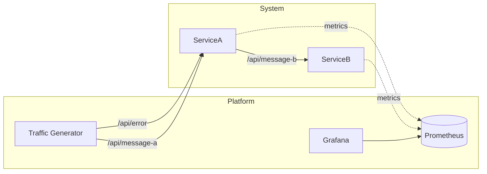

# Distributed system example

Demonstrates basic service-to-service communication with observability.

- ServiceA
  - Port: 10001
  - API
    - POST: /api/message-a
    - POST: /api/error
  - Swagger: http://localhost:10001/swagger/index.html
- ServiceB
  - Port: 10002
  - API
    - POST: /api/message-b

